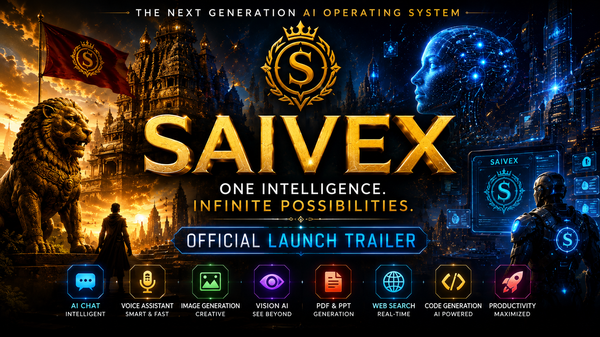

[README.md](https://github.com/user-attachments/files/29429640/README.md)
# SAIVEX

> **The Next Generation AI Operating System**

SAIVEX is an AI platform designed to bring multiple AI capabilities
together in a single application. It combines conversational AI,
productivity tools, creative generation, voice interaction, and a
futuristic Kalinga-inspired interface.
# 🎬 Official Launch Trailer

<p align="center">
<a href="https://youtu.be/EjDkpvuMxTw">

</a>
</p>

<p align="center">
<b>▶ Click the thumbnail to watch the Official SAIVEX Launch Trailer</b>
</p>

## ✨ Features

### AI

-   Intelligent AI Chat
-   Multi-model architecture
-   Memory support

### Productivity

-   PDF Generation
-   PowerPoint (PPTX) Generation
-   Website Generation
-   Document Generation

### Creative

-   AI Image Generation
-   Poster & Wallpaper Generation

### Vision

-   Image Analysis
-   Camera Vision

### Voice

-   Voice Assistant
-   Speech-to-Text
-   Text-to-Speech

### Search

-   Web Search

## 🛠 Tech Stack

-   Python
-   Flask
-   HTML
-   CSS
-   JavaScript
-   SQLAlchemy
-   SQLite
-   OpenRouter API

## 📦 Installation

``` bash
git clone https://github.com/YOUR_USERNAME/saivex.git
cd saivex
python -m venv venv
pip install -r requirements.txt
python app.py
```

Open: `http://127.0.0.1:5000`

## 📁 Project Structure

``` text
SAIVEX/
├── app.py
├── legacy_app.py
├── brain/
├── routes/
├── services/
├── voice/
├── vision/
├── productivity/
├── templates/
├── static/
└── uploads/
```

## 🗺 Roadmap

-   AI Chat
-   Image Generation
-   PDF/PPT Generation
-   Android App
-   Google Play Release
-   Docker Deployment

## 🤝 Contributing

Contributions are welcome.

## 📄 License

Choose a license such as MIT before accepting contributions.

------------------------------------------------------------------------

**SAIVEX** --- *One Intelligence. Infinite Possibilities.*
